# ivolve-CloudDevOpsProject

End-to-end DevOps pipeline for a microservices-based web application: containerization, infrastructure provisioning, configuration management, orchestration, continuous integration, and continuous deployment — built on Docker, Terraform, Ansible, Kubernetes (EKS), Jenkins, and ArgoCD.

---

## Table of Contents

1. [Overview](#overview)
2. [Quick Start](#quick-start)
3. [Architecture](#architecture)
4. [Repository Layout](#repository-layout)
5. [Prerequisites](#prerequisites)
6. [Local Development with Docker Compose](#local-development-with-docker-compose)
7. [Infrastructure Provisioning with Terraform](#infrastructure-provisioning-with-terraform)
8. [Configuration Management with Ansible](#configuration-management-with-ansible)
9. [Container Orchestration with Kubernetes](#container-orchestration-with-kubernetes)
10. [Continuous Integration with Jenkins](#continuous-integration-with-jenkins)
11. [Continuous Deployment with ArgoCD](#continuous-deployment-with-argocd)
12. [Monitoring with Prometheus & Grafana](#monitoring-with-prometheus--grafana)
13. [System Verification & End-to-End Testing](#system-verification--end-to-end-testing)
14. [Real-World Troubleshooting & Solutions](#real-world-troubleshooting--solutions)
15. [Screenshots Index](#screenshots-index)


---

## Overview

This project is based on the source application from [`iVolveFinalProject`](https://github.com/Ibrahim-Adel15/iVolveFinalProject) and is organized as a complete DevOps pipeline around it.

The application consists of three independent microservices behind a frontend, backed by MySQL:

| Service           | Technology               | Responsibility                          | Port |
| ------------------ | ------------------------- | ----------------------------------------- | ---- |
| `frontend`         | Node.js / Express / EJS   | Web UI and user interaction               | 3000 |
| `auth-service`     | Python / Flask             | User signup and login, database access    | 5000 |
| `roadmap-service`  | Java / Spring Boot         | Serves roadmap data (no DB dependency)    | 8080 |
| `mysql`            | MySQL 8.0                  | Stores application users                  | 3306 |


This repo delivers, for each stage of the pipeline:

* Local containerized testing with Docker Compose
* AWS infrastructure provisioning with Terraform (VPC, Jenkins EC2, EKS, ECR, S3 remote state)
* Jenkins + SonarQube EC2 configuration with Ansible (roles, dynamic inventory, vault)
* Kubernetes manifests deploying the app into EKS
* A Jenkins CI pipeline per microservice (build → code scan → security scan → push → update manifests → GitOps push)
* ArgoCD continuous deployment following GitOps

## Quick Start
 
The fastest path from a clean checkout to a running app in EKS. Each step links to its full section below for explanations, screenshots, and troubleshooting.
 
```bash
git clone https://github.com/ahmeddhussain/ivolve-CloudDevOpsProject.git
cd ivolve-CloudDevOpsProject
```
 
**1. (Optional) Test the app locally first** — [details](#local-development-with-docker-compose)
```bash
cd docker && docker compose up --build
# http://localhost:3000
```
 
**2. Provision AWS infrastructure** — [details](#infrastructure-provisioning-with-terraform)
```bash
cd terraform
terraform init
terraform apply --auto-approve      
```
 
**3. Configure Jenkins + SonarQube** — [details](#configuration-management-with-ansible)
```bash
cd ../ansible
# create + encrypt group_vars/all/vault.yml first — see the Ansible section
ansible-inventory --graph
ansible-playbook site.yml --ask-vault-pass
```
 
**4. Set up Jenkins** — [details](#continuous-integration-with-jenkins)
- Log into `http://<EC2_PUBLIC_IP>:8080`.
- Add Global Pipeline Library `jenkins-shared-library` pointing at this repo.
- Add credentials: `github-credentials`, `AWS_ACCESS_KEY_ID`, `AWS_SECRET_ACCESS_KEY`, `sonarqube-token`.
- Create 3 pipeline jobs from `Jenkinsfile.frontend`, `Jenkinsfile.auth`, `Jenkinsfile.roadmap`, and build each once — this pushes images to ECR and writes the tags into `k8s/`.

**5. Deploy ArgoCD** — [details](#continuous-deployment-with-argocd)
```bash
aws eks update-kubeconfig --region us-east-1 --name ivolve-eks-cluster
kubectl create namespace argocd
kubectl apply -n argocd -f https://raw.githubusercontent.com/argoproj/argo-cd/stable/manifests/install.yaml
kubectl apply -f ../argocd/application.yml
kubectl apply -f ../argocd/svc-lb.yml
```
 
**6. Verify** — [details](#system-verification--end-to-end-testing)
```bash
kubectl get pods -n ivolve
kubectl get ingress -n ivolve   # grab the ALB address
```
Open `http://<ALB_DNS_NAME>/signup` in a browser.
 
**7. (Optional) Deploy monitoring** — [details](#monitoring-with-prometheus--grafana)
```bash
kubectl apply -f argocd/monitoring-application.yml
```
Open `http://<ALB_DNS_NAME>/grafana` once synced.

---

## Architecture


 
### Infrastructure Overview
 
```text
Internet
  │
  ▼
AWS VPC
  ├── Public Subnets (2 AZs)
  │     └── Jenkins + SonarQube EC2
  │
  ├── Private Subnets (2 AZs)
  │     └── EKS Worker Nodes
  │
  ├── NAT Gateway, Internet Gateway
  └── Security Groups / Network ACLs
 
Amazon ECR ── stores built images (frontend, auth, roadmap)
AWS Load Balancer Controller (Helm, IRSA) ── provisions the ALB from the frontend Ingress
Amazon EBS CSI Driver (IRSA) ── backs the MySQL StatefulSet's persistent volume
ArgoCD ── GitOps-syncs k8s/ manifests to the EKS `ivolve` namespace
```

---

## Prerequisites

* Docker and Docker Compose
* Terraform (>= 1.10, for native S3 state locking via `use_lockfile`)
* Helm (the `eks` module's `helm_release` resource needs the `helm` provider, which in turn talks to the cluster via your local kubeconfig — see the note in the Terraform section below)
* AWS CLI configured with credentials that can manage VPC, EC2, EKS, ECR, IAM, and S3
* kubectl
* Ansible (with the `amazon.aws` collection installed, for the dynamic inventory plugin)
* A GitHub repository with credentials Jenkins can push to
* An existing EC2 key pair (referenced by name, not by file path ) and an S3 bucket for Terraform state

---

## Local Development with Docker Compose

All four components are defined in [`docker/docker-compose.yaml`](./docker/docker-compose.yaml), which builds the three microservices from [`docker/iVolveFinalProject/`](./docker/iVolveFinalProject/).

### Run locally

```bash
cd docker
docker compose up --build
```

### What this does

1. Builds the `frontend`, `auth-service`, and `roadmap-service` images from `docker/iVolveFinalProject/<service>/Dockerfile`.
2. Starts MySQL first and waits for its healthcheck before starting `auth-service`.
3. Starts `auth-service`, `roadmap-service`, and `frontend`.
4. Exposes the services locally.

### Local ports

* Frontend: `http://localhost:3000`
* Auth Service: `http://localhost:5000`
* Roadmap Service: `http://localhost:8080`
* MySQL: `localhost:3306`

### Verify the application

* Open the frontend in your browser and create a new account.

  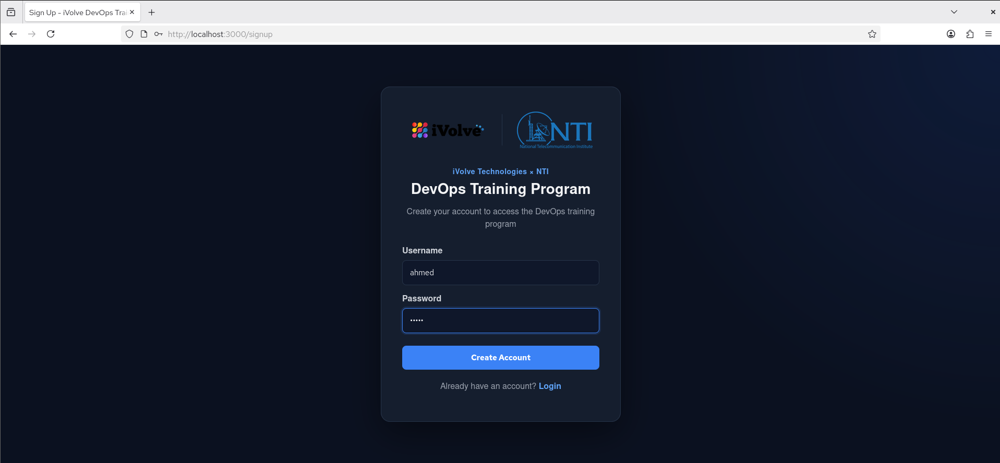

* Log in with the new account and confirm the roadmap page opens.

  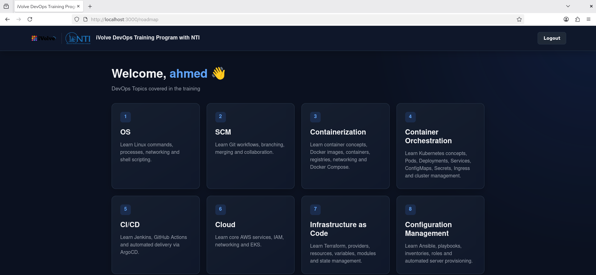

* Confirm the database contains the new user record:

  ```bash
  docker exec -it mysql mysql -u ahmed -p ivolve
  ```
  ```sql
  SHOW TABLES;
  SELECT id, username, created_at FROM users;
  ```

  

### Stop the stack

```bash
docker compose down -v
```

---

## Infrastructure Provisioning with Terraform

Terraform provisions the AWS environment for Jenkins and Kubernetes, split into four modules with an S3 backend for remote state.

### Modules

**1. `network`** —> VPC, public/private subnets (2 AZs), Internet Gateway, single NAT Gateway, public/private route tables, and a Network ACL. Public and private subnets are tagged `kubernetes.io/role/elb` / `kubernetes.io/role/internal-elb` so the AWS Load Balancer Controller can auto-discover them.

**2. `server`** —>  the Jenkins + SonarQube EC2 instance (Ubuntu 22.04, tagged `Role: Jenkins` for Ansible's dynamic inventory) and its security group (SSH 22, Jenkins 8080, SonarQube 9000).

**3. `eks`** —> the EKS cluster and a 2-node managed node group spread across the private subnets/AZs, cluster and node IAM roles, an OIDC provider for IRSA, plus:
   - an IRSA role for the **AWS Load Balancer Controller**, installed directly by Terraform via `helm_release`, so the frontend Ingress can provision a real ALB;
   - an IRSA role for the **EBS CSI driver**, enabled as an EKS addon, so the MySQL StatefulSet's PVC can actually bind.

   Both avoid relying on EC2 instance metadata (IMDS) for AWS credentials, which is unreliable for pod-level AWS API access on EKS — see [Troubleshooting](#real-world-troubleshooting--solutions).

**4. `ecr`** —> one repository each for `ivolve-frontend`, `ivolve-auth`, `ivolve-roadmap`.

**Backend** —> S3 bucket (`terraform/backend.tf`), with native S3 state locking (`use_lockfile = true`).

### Terraform commands

```bash
cd terraform
terraform init
terraform plan
terraform apply --auto-approve
```

> **Automatic Dependency Waiting:** Terraform calculates the resource dependency graph so that the Helm provider automatically **waits for the EKS cluster to be fully provisioned and ready** before attempting to fetch the authentication token or install Helm releases. This eliminates local `kubeconfig` dependencies and manual two-phase applies, executing the entire infrastructure in a single, 100% automated `terraform apply` run.


### Test Results

* VPC, subnets, NAT/IGW, and route tables created successfully.
* Jenkins EC2 instance provisioned, with the Terraform state stored remotely in S3.

  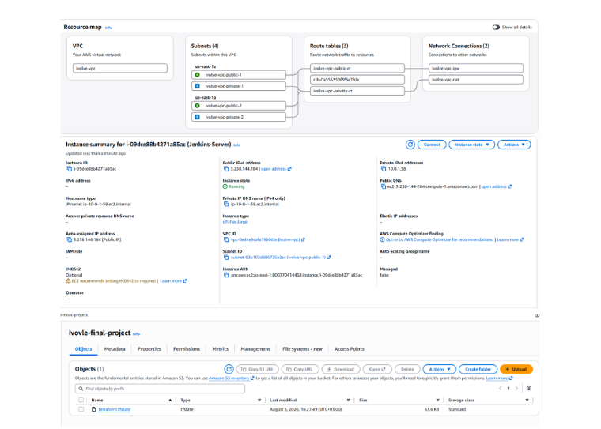

* EKS cluster active with a 2-node worker group across separate AZs, and all three ECR repositories created.

  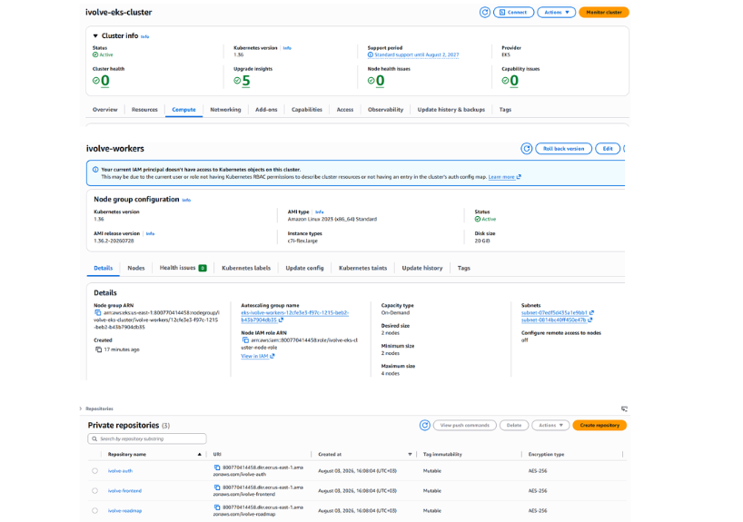

---

## Configuration Management with Ansible

Ansible configures the Jenkins/SonarQube EC2 instance after Terraform provisions it, using modular Roles, an AWS dynamic inventory, and Ansible Vault for secrets.

### What each role does

* **`common`** —> installs OpenJDK 21, AWS CLI, SoanrQube CLI and base packages.
* **`docker`** —> installs Docker Engine, adds `ubuntu` to the `docker` group.
* **`trivy`** —> installs the Trivy CLI for image scanning.
* **`sonarqube`** —> runs SonarQube Community in Docker on port 9000, tunes `vm.max_map_count`/`fs.file-max`, waits for the API to report `UP`, then via REST API: changes the default admin password with vault password, and generates a pipeline token.
* **`jenkins`** —> installs Jenkins, adds `jenkins` to the `docker` group, starts the service.
* **`jenkins-config`** —> waits for the initial admin password file, then drops a Groovy script into `init.groovy.d` that creates the admin account from Vault variables, installs the required plugins (Git, GitHub, Docker Pipeline, SonarQube Scanner, Pipeline, etc.), and marks the setup wizard complete — so Jenkins comes up fully configured with no manual wizard steps.

### Dynamic Inventory & Vault

* **`inventory/aws_ec2.yml`** uses the `amazon.aws.aws_ec2` plugin, filtered to `tag:Role: Jenkins` and `instance-state-name: running`, keyed by tags (so `site.yml` can target `hosts: tag_Role_Jenkins`).
* **`group_vars/all/vault.yml`** is intentionally **not committed** (see `.gitignore`) — it must be created locally before running the playbook, containing at minimum:
  ```yaml
  vault_sonarqube_admin_password: "<12+ character password>"
  vault_jenkins_admin_user: "<admin username>"
  vault_jenkins_admin_password: "<admin password>"
  ```
  Encrypt it with `ansible-vault encrypt group_vars/all/vault.yml` before running the playbook.

### How to run

* Confirm the EC2 instance is discovered:
  ```bash
  ansible-inventory --graph
  ```
  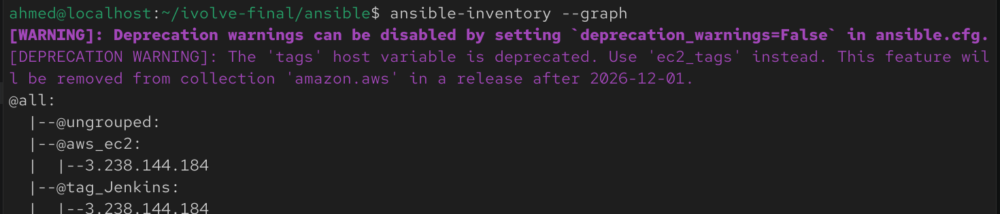

* Run the master playbook:
  ```bash
  ansible-playbook site.yml --ask-vault-pass
  ```
  

### Test Results

* Java 21, Docker, and Trivy installed and verified.
* SonarQube reachable at `http://<EC2_PUBLIC_IP>:9000` with a pipeline token generated.

  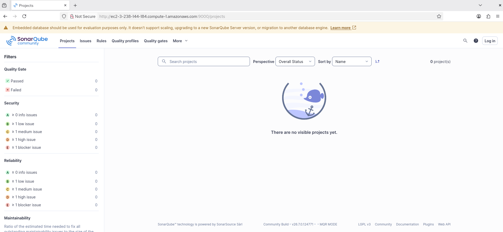

* Jenkins reachable at `http://<EC2_PUBLIC_IP>:8080`, already past the setup wizard with the admin account and plugins pre-configured.

  

---

## Container Orchestration with Kubernetes

The manifests in [`k8s/`](./k8s/) deploy the application into the EKS cluster's `ivolve` namespace:

* `namespace.yml` —> the `ivolve` namespace.
* `configmap.yml` —> non-secret config (`DB_HOST`, `DB_PORT`, `DB_NAME`, `DB_USER`, `AUTH_SERVICE_URL`, `ROADMAP_SERVICE_URL`).
* `secret.yml` —> `DB_PASSWORD`, `DB_ROOT_PASSWORD`, `JWT_SECRET`.
* `storageclass.yml` —> `ebs-sc`, backed by `kubernetes.io/aws-ebs` (gp2, `WaitForFirstConsumer`, `Retain`).
* `db-statefulset.yml` / `db-headless-svc.yml` —> single-replica MySQL StatefulSet with a 5Gi PVC via `ebs-sc`, and its headless service (`mysql-0.mysql.ivolve.svc.cluster.local`, referenced directly by the ConfigMap's `DB_HOST`).
* `frontend-deploy-svc.yml`, `auth-deploy-svc.yml`, `roadmap-deploy-svc.yml` —> one Deployment + ClusterIP Service per microservice, each pulling its image from ECR and wired to the ConfigMap/Secret.
* `ingress.yml` —> `frontend-ingress`, `ingressClassName: alb`, `scheme: internet-facing`, `target-type: ip`, routing `/` to `frontend-service:80`. Provisioned by the AWS Load Balancer Controller installed in the Terraform step.

> The Ingress currently has no custom `host` rule — it's reaches via the ALB's own AWS-generated DNS name (see the Test Results below), not a custom domain.

### Example kubectl commands

```bash
kubectl apply -f k8s/namespace.yml
kubectl apply -f k8s/
kubectl get pods -n ivolve
kubectl get svc -n ivolve
kubectl get ingress -n ivolve
```

### Test Results

* All four workloads (`auth-service`, `frontend-service`, `roadmap-service`, `mysql-0`) `Running` with `0` restarts.
* All Services resolved correctly; the MySQL StatefulSet bound its persistent volume.
* The `frontend-ingress` received an `ADDRESS` from the AWS Load Balancer Controller.

  

---

## Continuous Integration with Jenkins

Each microservice has its own pipeline file at the repo root — `Jenkinsfile.frontend`, `Jenkinsfile.auth`, `Jenkinsfile.roadmap` — all built on a shared library.

### Pipeline Stage Flow

```text
Checkout SCM
  ↓
Build Docker Image
  ↓
SonarQube Code Quality Scan
  ↓
Trivy Security Scan
  ↓
Push Image to AWS ECR
  ↓
Delete Image Locally (Disk Space Cleanup)
  ↓
Update Kubernetes Manifest Tag
  ↓
Push Updated Manifests to GitHub (GitOps)
```

### Shared Library (`vars/`)

| File | Purpose |
|---|---|
| `buildimage.groovy` | `docker build` with a dynamic context path (e.g. `docker/iVolveFinalProject/frontend`) |
| `sonarscan.groovy` | Runs `sonarsource/sonar-scanner-cli` in Docker against the EC2's SonarQube, with `node_modules`/binary exclusions and a JS memory cap |
| `scanimage.groovy` | `trivy image --severity HIGH,CRITICAL` (currently `--exit-code 0`, i.e. reports but does not fail the build) |
| `pushimage.groovy` | Logs into ECR and pushes the tagged image, via Jenkins credentials `AWS_ACCESS_KEY_ID`/`AWS_SECRET_ACCESS_KEY` |
| `deleteimagelocally.groovy` | Removes the local and ECR-tagged images post-push |
| `updatemanifests.groovy` | `sed`-replaces the `image:` line in the service's `k8s/*-deploy-svc.yml` |
| `pushmanifests.groovy` | Commits and pushes the updated manifest via `github-credentials`, triggering ArgoCD |

### Setup notes

* Each `Jenkinsfile.*` starts with `@Library('jenkins-shared-library') _` — this name must be configured under **Manage Jenkins → System → Global Pipeline Libraries** pointing at this repository (with `vars/` at its root) before any pipeline can run.
* Configure Jenkins credentials: `github-credentials` (GitHub push), `AWS_ACCESS_KEY_ID` / `AWS_SECRET_ACCESS_KEY` (ECR push), and `sonarqube-token` (the token generated by the Ansible `sonarqube` role).
* Each `Jenkinsfile.*` runs as a separate pipeline, one per microservice, each triggered independently on commit.

### Test Results

* All three pipelines (`frontend-pipeline`, `auth-pipeline`, `roadmap-pipeline`) green.

  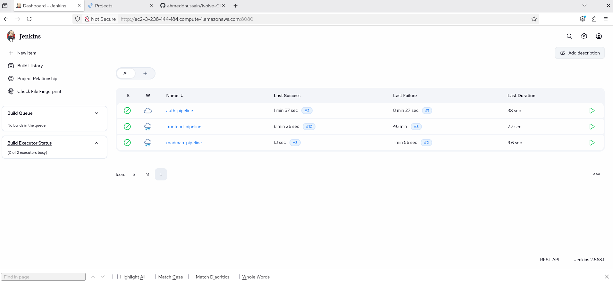

* SonarQube shows all three projects passing their quality gate.

  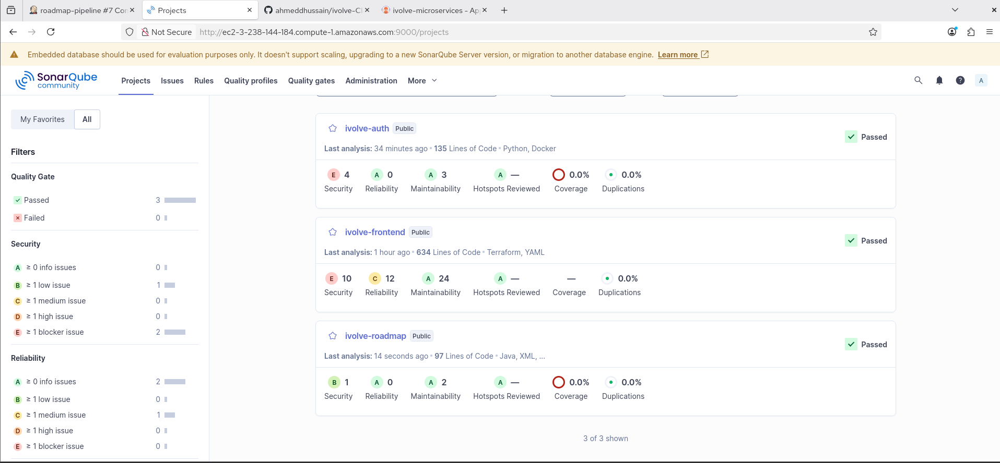

* ECR populated with tag-indexed images per push.

  

---

## Continuous Deployment with ArgoCD

ArgoCD runs inside the EKS cluster and handles Continuous Deployment via GitOps.

### GitOps Workflow

1. **Jenkins (CI)** pushes updated image tags into `k8s/` on GitHub.
2. **ArgoCD (CD)** polls the repository for changes under the `k8s/` path.
3. ArgoCD applies changes to the `ivolve` namespace in EKS.
4. ArgoCD enforces **self-healing** and **pruning**, keeping cluster state in sync with Git.

### ArgoCD Application ([`argocd/application.yml`](./argocd/application.yml))

* **Repository:** `https://github.com/ahmeddhussain/ivolve-CloudDevOpsProject.git`
* **Path:** `k8s/`
* **Destination namespace:** `ivolve`
* **Sync policy:** `automated`, `prune: true`, `selfHeal: true`, `CreateNamespace=true`

### Setup steps

```bash
# 1. Point kubectl at the cluster
aws eks update-kubeconfig --region us-east-1 --name ivolve-eks-cluster

# 2. Install the ArgoCD controller
kubectl create namespace argocd
kubectl apply -n argocd -f https://raw.githubusercontent.com/argoproj/argo-cd/stable/manifests/install.yaml

# 3. Deploy the Application and expose the ArgoCD UI externally
kubectl apply -f argocd/application.yml
kubectl apply -f argocd/svc-lb.yml

# 4. Verify
kubectl get pods -n ivolve
kubectl get svc -n ivolve
kubectl get ingress -n ivolve

# 5. Get the initial admin password and the UI's EXTERNAL-IP
kubectl -n argocd get secret argocd-initial-admin-secret -o jsonpath="{.data.password}" | base64 -d; echo
kubectl get svc argocd-server -n argocd
```

Log into the ArgoCD UI at the `EXTERNAL-IP` with user `admin` and the password from step 5.

### Test Results

* ArgoCD shows the `ivolve-microservices` & `ivolve-mointoring` Applications as **Healthy** and **Synced**, with the full resource tree (Deployments, ReplicaSets, Pods, the MySQL StatefulSet + PVC, and the frontend Ingress) all green.

  
  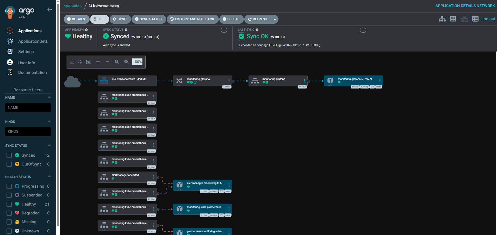

---

## Monitoring with Prometheus & Grafana
 
Cluster and infrastructure metrics via the `kube-prometheus-stack` Helm chart (Prometheus + Grafana + Alertmanager + node-exporter + kube-state-metrics), deployed the same GitOps way as the app itself — as an ArgoCD Application whose `source` is a Helm chart rather than a git path.
 
### Scope: infrastructure-only
 
This covers **cluster and pod-level metrics only** — node CPU/memory, pod restarts, resource usage, EKS control-plane health, and Kubernetes object state (Deployments, StatefulSets, PVCs). All of that comes from `node-exporter` and `kube-state-metrics`, both bundled in the chart and both bundled with their own `ServiceMonitor`s (`monitoring.coreos.com/v1`, installed as part of the same Helm release).
 
What this setup does **not** give you: application-level metrics like requests/sec, response latency, or error rate per microservice. Those only exist if the app itself exposes them (e.g. via `prom-client`, `prometheus-flask-exporter`, or Spring Actuator) — genuinely out of scope here since it requires touching the app source.
 
### Why it shares the ALB
 
Grafana shares the **same ALB** as the frontend instead of provisioning a second load balancer, via the AWS Load Balancer Controller's `IngressGroup` feature — both `k8s/ingress.yml` (frontend, `/`) and the chart's own Grafana ingress (`/grafana`) carry the annotation `alb.ingress.kubernetes.io/group.name: ivolve-shared-alb`, so the controller merges them into one ALB with two path rules. `group.order` (`10` for the frontend, `1` for Grafana) makes sure the more specific `/grafana` rule is evaluated before the frontend's catch-all `/`.
 
### Deploy
 
```bash
kubectl apply -f argocd/monitoring-application.yml
```
 
 
### Access Grafana
 
```text
http://<ALB_DNS_NAME>/grafana
```
 
Default login is `admin` / the chart's auto-generated admin password:
```bash
kubectl get secret -n monitoring monitoring-grafana -o jsonpath="{.data.admin-password}" | base64 -d; echo
```
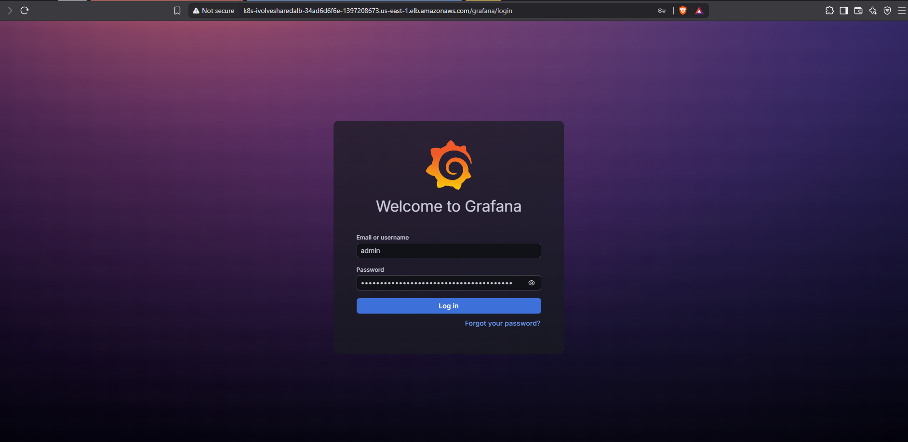 

Grafana ships with pre-built dashboards for Kubernetes cluster health, node resource usage, and per-namespace/per-pod resource consumption out of the box — no extra setup needed for those.

### Test Results

Go to `http://<ALB_DNS_NAME>/grafana`, log in, then Dashboards in the left sidebar. The chart ships a set of pre-built dashboards — these are the ones worth opening:

- **Kubernetes / Compute Resources / Cluster:** Total CPU/memory usage across your whole 2-node cluster, as live graph
- **Node Exporter / Nodes	Raw host-level:** metrics per EC2 node — CPU, memory, disk, network, load average
- **Kubernetes / Compute Resources / Namespace (Pods)**:	Switch the namespace dropdown to ivolve — per-pod CPU/memory for your frontend, auth-service, roadmap-service, and mysql-0

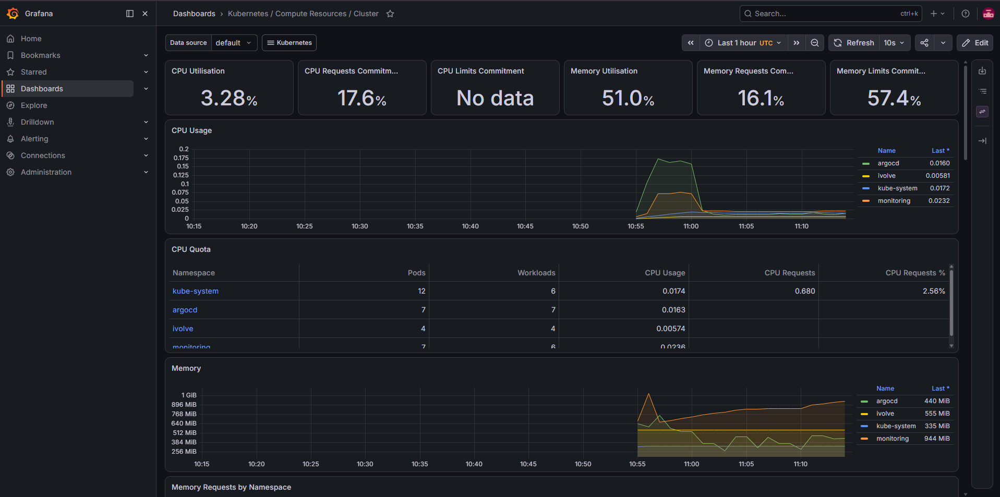 
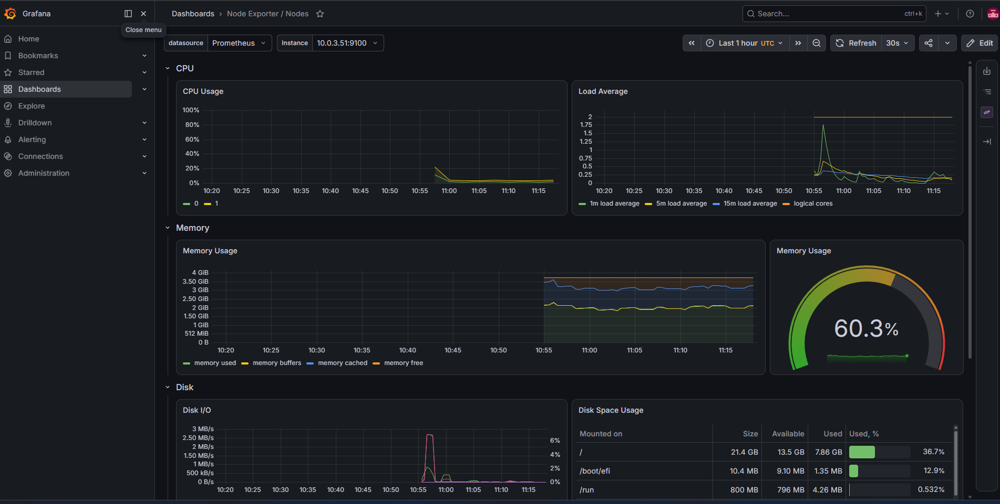 
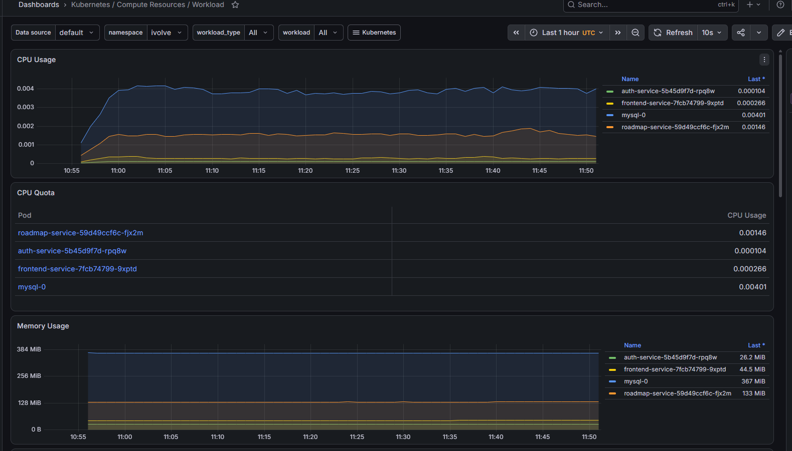 

---
## System Verification & End-to-End Testing

Full-chain verification: Frontend → backend microservices → MySQL, all running in EKS.

### Step 1: Access the frontend

Open the ALB's DNS name (from `kubectl get ingress -n ivolve`, or the AWS Console) in a browser:

```text
http://<ALB_DNS_NAME>/signup
```

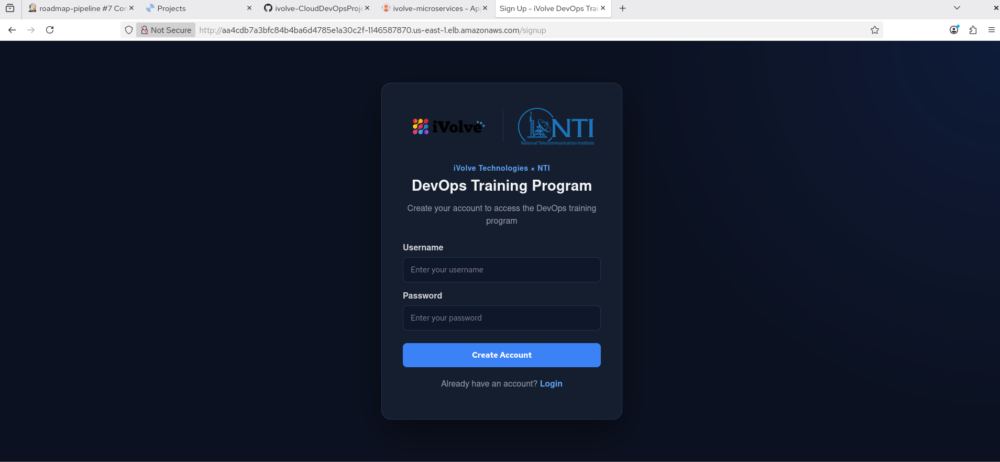

### Step 2: Test `auth-service`

* Create a test account and log in through the UI.
* The frontend POSTs to `auth-service` (port 5000), which writes the user record into MySQL.

### Step 3: Test `roadmap-service`

* After login, the frontend loads the Roadmap page, calling `roadmap-service` (port 8080) for the training-topics data.


### Step 4: Verify database persistence

Confirm the signup actually persisted to disk inside the `mysql-0` pod:

```bash
kubectl exec -it mysql-0 -n ivolve -- mysql -u ahmed -pahmedpass ivolve
```
```sql
SHOW TABLES;
SELECT id, username, created_at FROM users;
```

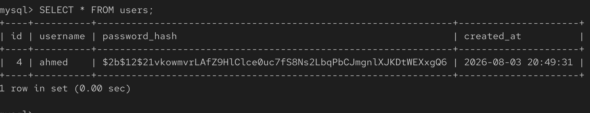

---

## Real-World Troubleshooting & Solutions

Issues actually hit while building this project, and how they were resolved.

### 1. Infrastructure & Terraform

* **EC2 disk space exhaustion:** the default 8GB root volume filled up under concurrent Docker images, the JDK, and SonarQube. **Fix:** raised the root volume to 20–30GB in the `server` module, and on already-running instances ran `sudo growpart /dev/nvme0n1 1` + `sudo resize2fs` to extend the ext4 filesystem online.

### 2. Ansible & Server Configuration

* **SonarQube admin password policy (HTTP 400):** the REST API password-change call failed because SonarQube enforces a 12-character minimum. **Fix:** set `vault_sonarqube_admin_password` in `vault.yml` to a 12+ character value.
* **Jenkins startup failure ("Java 17 older than required Java 21"):** recent Jenkins releases require Java 21+. **Fix:** the `common` role installs `openjdk-21-jdk`.

### 3. Jenkins CI & Shared Libraries

* **Docker build context ("path not found"):** the microservices live in a subdirectory (`docker/iVolveFinalProject/<service>`) cloned from a separate upstream repo. **Fix:** each `Jenkinsfile.*` passes that relative path explicitly to `buildimage(...)`, and the source app was merged into this repo under `docker/iVolveFinalProject/`.
* **SonarScanner memory freeze:** the JS sensor froze trying to analyze binary `.png`s and `node_modules`. **Fix:** `sonarscan.groovy` runs the scanner in Docker with `-Dsonar.javascript.node.maxspace=512` and excludes `**/node_modules/**,**/*.png,**/*.jpg`.

### 4. Kubernetes & ArgoCD GitOps

* **PVC stuck `Pending` (EBS CSI auth failure):** the EBS CSI controller pods were `CrashLoopBackOff` with `no EC2 IMDS role found` — IMDS isn't a reliable credential source for pod-level AWS API access on EKS. **Fix:** a dedicated IRSA role with `AmazonEBSCSIDriverPolicy`, bound via `service_account_role_arn` on the `aws_eks_addon.ebs_csi` resource.
* **Ingress `ADDRESS` pending:** no AWS Load Balancer Controller was installed, so nothing could provision an ALB for `ingressClassName: alb`. **Fix:** installed the controller via Helm (now done directly by Terraform) with its own IRSA role.
* **ALB Controller `CrashLoopBackOff` (IMDS timeout):** `failed to get VPC ID from instance metadata` / `failed to introspect region from EC2Metadata` — same root cause as the EBS CSI issue. **Fix:** passed `vpcId` and `region` explicitly to the Helm release instead of relying on IMDS auto-discovery, and bound the controller's ServiceAccount to its IRSA role via the `eks.amazonaws.com/role-arn` annotation.


---

## Screenshots Index

Quick reference for every file in [`screenshots/`](./screenshots/) and where it's used above.

| File | Shows | Used in |
|---|---|---|
| `image.png` | Local signup page (`localhost:3000`) | Docker Compose |
| `image-1.png` | Local roadmap page after login | Docker Compose |
| `image-2.png` | Local MySQL container, `SELECT * FROM users` | Docker Compose |
| `image-3.png` | AWS Console: VPC resource map, Jenkins EC2, S3 state bucket | Terraform |
| `image-4.png` | AWS Console: EKS cluster, node group, ECR repositories | Terraform |
| `image-5.png` | `ansible-inventory --graph` | Ansible |
| `image-6.png` | SonarQube web UI, live | Ansible |
| `image-7.png` | `ansible-playbook site.yml` PLAY RECAP | Ansible |
| `image-8.png` | Jenkins dashboard, live | Ansible |
| `image-9.png` | Jenkins: all 3 pipelines green | Jenkins CI |
| `image-10.png` | SonarQube: all 3 projects passed | Jenkins CI |
| `image-11.png` | ECR `ivolve-frontend`, tagged images | Jenkins CI |
| `image-12.png` | ArgoCD: `ivolve-microservices` Healthy + Synced resource tree | ArgoCD |
| `image-13.png` | Signup page via ALB DNS name | System Verification |
| `image-14.png` | `kubectl get pods/svc/ingress -n ivolve` | Kubernetes |
| `image-15.png` | Roadmap page via ALB DNS name | System Verification |
| `image-16.png` | `mysql-0` pod, persisted user record | System Verification |
| `image-17.png` | Grafana login screen | Mointoring |
| `image-18.png` | Grafana Kubernetes / Compute Resources / Cluster Dashboard | Mointoring |
| `image-19.png` | Grafana Node Exporter / Nodes Dashboard | Mointoring |
| `image-20.png` | Grafana Kubernetes / Compute Resources / Computing Dashboard | Mointoring |
| `image-21.png` | ArgoCD: `ivolve-mointoring` Healthy + Synced resource tree | ArgoCD |


---

