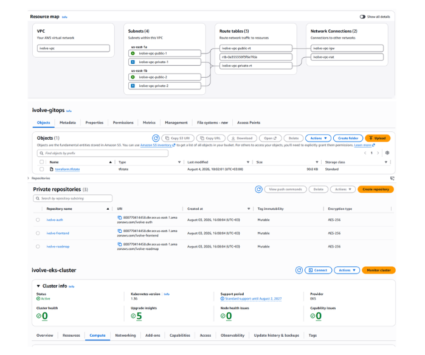
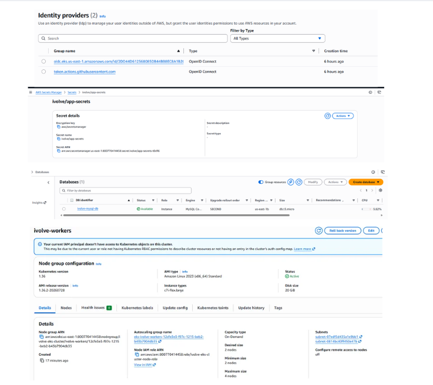
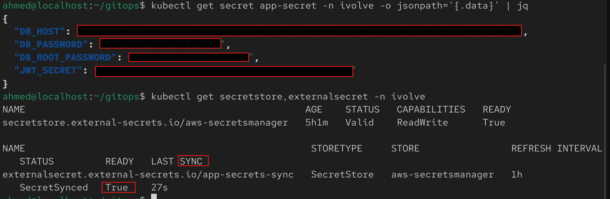
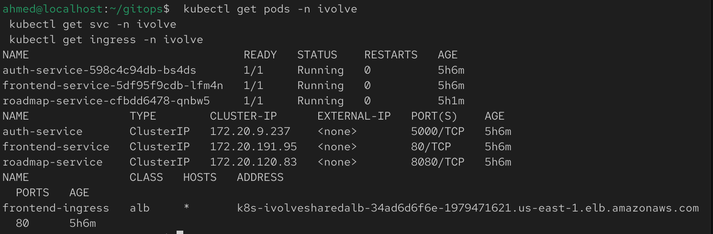
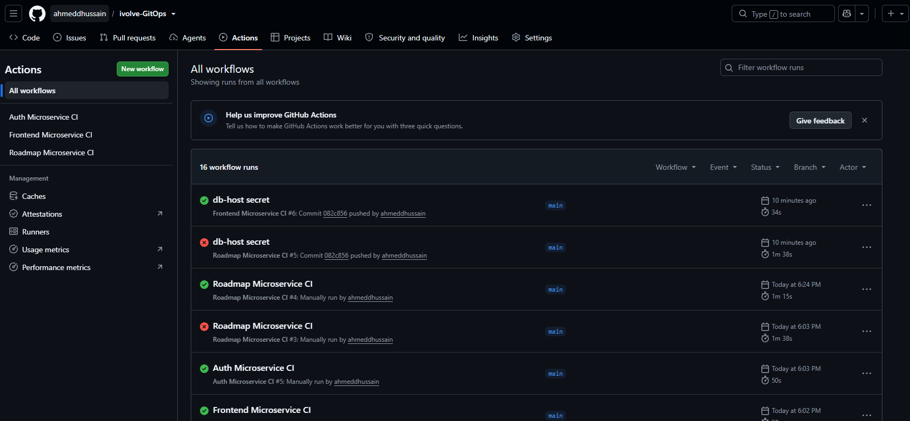
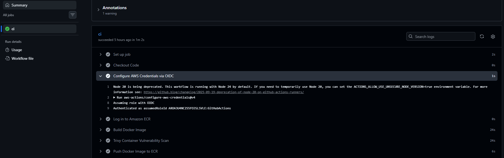

# ivolve-GitOps

An advanced, enterprise-grade DevOps platform for a microservices-based web application. This project demonstrates a 100% serverless CI and pull-based CD architecture using Docker, Terraform, Kubernetes (EKS), GitHub Actions (with AWS OIDC), ArgoCD, Amazon RDS, and AWS Secrets Manager via External Secrets Operator.


---

## Table of Contents

1. [Overview](#overview)
2. [Quick Start](#quick-start)
3. [Architecture](#architecture)
4. [Prerequisites](#prerequisites)
5. [Local Development with Docker Compose](#local-development-with-docker-compose)
6. [Infrastructure Provisioning with Terraform](#infrastructure-provisioning-with-terraform)
7. [Secrets Management: AWS Secrets Manager + External Secrets Operator](#secrets-management-aws-secrets-manager--external-secrets-operator)
8. [Container Orchestration with Kubernetes](#container-orchestration-with-kubernetes)
9. [Continuous Integration with GitHub Actions](#continuous-integration-with-github-actions)
10. [Continuous Deployment with ArgoCD](#continuous-deployment-with-argocd)
11. [Monitoring with Prometheus & Grafana](#monitoring-with-prometheus--grafana)
12. [System Verification & End-to-End Testing](#system-verification--end-to-end-testing)
13. [Real-World Troubleshooting & Solutions](#real-world-troubleshooting--solutions)
14. [Known Issues / Cleanup TODOs](#known-issues--cleanup-todos)
15. [Screenshots Index](#screenshots-index)
16. [License](#license)

---

## Overview

This project is organized as a complete, zero-maintenance GitOps pipeline around a 3-tier microservice application : [`iVolveFinalProject`](https://github.com/Ibrahim-Adel15/iVolveFinalProject)

| Service | Technology | Responsibility | Port |
|---|---|---|---|
| `frontend` | Node.js / Express / EJS | Web UI | 3000 |
| `auth-service` | Python / Flask | Signup/login, DB access | 5000 |
| `roadmap-service` | Java / Spring Boot | Roadmap data (no DB) | 8080 |
| Amazon RDS (MySQL 8.0) | Managed | Stores users | 3306 |


## Quick Start

```bash
git clone https://github.com/ahmeddhussain/ivolve-GitOps.git
cd ivolve-GitOps
```

**1. (Optional) Test locally** — [details](#local-development-with-docker-compose)
```bash
cd docker && docker compose up --build
```

**2. Provision AWS infrastructure** — [details](#infrastructure-provisioning-with-terraform)
```bash
cd terraform
terraform init
terraform apply --auto-approve
```

**3. Point kubectl at the cluster**
```bash
aws eks update-kubeconfig --region us-east-1 --name ivolve-eks-cluster
kubectl get pods -n external-secrets   # confirm ESO is running (installed by Terraform)
```

**4. Deploy the app + secrets sync via ArgoCD** — [details](#continuous-deployment-with-argocd)
```bash
kubectl create namespace argocd
kubectl apply -n argocd -f https://raw.githubusercontent.com/argoproj/argo-cd/stable/manifests/install.yaml
kubectl apply -f argocd/application.yml
kubectl apply -f argocd/svc-lb.yml
```

**5. Set up GitHub Actions** — [details](#continuous-integration-with-github-actions)
- Confirm `GitHubActionsECRRole` exists (created by Terraform) and its trust policy matches your repo.
- Push to `main` under `docker/iVolveFinalProject/<service>/**` to trigger a pipeline — or run any workflow manually via **Actions → (workflow) → Run workflow**.

**6. Verify**
```bash
kubectl get pods -n ivolve
kubectl get ingress -n ivolve
```
Open `http://<ALB_DNS_NAME>/signup`.

**7. (Optional) Deploy monitoring** — [details](#monitoring-with-prometheus--grafana)
```bash
kubectl apply -f argocd/mointoring-app.yml
```

---

## Architecture

### Application Flow
```text
Browser
  │
  ▼
frontend (Node.js/Express) ──► auth-service (Flask) ──► Amazon RDS (MySQL)
  │
  └────────────────────────► roadmap-service (Spring Boot)
```

### Infrastructure Overview
```text
Internet
  │
  ▼
AWS VPC
  ├── Public Subnets (2 AZs) — NAT Gateway, Internet Gateway
  └── Private Subnets (2 AZs)
        ├── EKS Worker Nodes
        └── Amazon RDS (MySQL) — security group restricted to the EKS node SG only

Amazon ECR ─────────────── stores built images (frontend, auth, roadmap)
AWS Load Balancer Controller (Helm, IRSA) ─ provisions the shared ALB from the two Ingresses
External Secrets Operator (Helm, IRSA) ──── syncs AWS Secrets Manager → k8s Secret `app-secret`
GitHub Actions (OIDC → GitHubActionsECRRole) ─ builds, scans, pushes images, updates k8s/ manifests
ArgoCD ─────────────────── GitOps-syncs k8s/ (app) and the kube-prometheus-stack Helm chart (monitoring)
```

---

## Prerequisites

* Docker and Docker Compose (local dev only)
* Terraform (>= 1.10)
* Helm (used by Terraform's `helm_release` resources — no separate manual install needed for the cluster add-ons themselves)
* AWS CLI configured with credentials that can manage VPC, EC2 networking, EKS, ECR, RDS, IAM, Secrets Manager, and S3
* kubectl
* A GitHub repository — **no server-side credentials to configure**, since CI auth is via OIDC (see the GitHub Actions section)

---

## Local Development with Docker Compose

Unchanged from the original project — RDS is AWS-only, so local dev still runs a throwaway MySQL container.

```bash
cd docker
docker compose up --build
```

* Frontend → `http://localhost:3000`
* Auth Service → `http://localhost:5000`
* Roadmap Service → `http://localhost:8080`

### Verify

* Sign up through the frontend.

  

* Log in and confirm the roadmap page loads.

  

* Confirm the record actually persisted:
  ```bash
  docker exec -it mysql mysql -u ahmed -p ivolve
  ```
  ```sql
  SELECT id, username, created_at FROM users;
  ```

  

```bash
docker compose down -v
```

---

## Infrastructure Provisioning with Terraform

### Modules

**`network`** —> VPC, 2 public + 2 private subnets across 2 AZs, IGW, single NAT Gateway, route tables, and Network ACLs.

**`eks`** —> cluster + 2-node managed node group in the private subnets, IAM roles, OIDC provider, and every IRSA role this project needs:
- AWS Load Balancer Controller (installed via `helm_release`, so the shared ALB gets provisioned automatically)
- External Secrets Operator's IRSA role (the Helm release itself is installed from root `main.tf`, not this module)
- **GitHub Actions OIDC**: a separate `aws_iam_openid_connect_provider` for `token.actions.githubusercontent.com`, plus `GitHubActionsECRRole`, trusted via a `StringLike` condition built from `var.github_repo` — see [Troubleshooting](#real-world-troubleshooting--solutions) for why this needs to be a wildcard, not an exact match.

**`ecr`** —> `ivolve-frontend`, `ivolve-auth`, `ivolve-roadmap` repositories.

**`rds`** —> single-AZ `db.t3.micro` MySQL instance, `publicly_accessible = false`, security group that only allows inbound 3306 from the EKS node security group (not `0.0.0.0/0`).

**`secrets`** —> one AWS Secrets Manager secret (`ivolve/app-secrets`) holding `DB_PASSWORD`, `DB_ROOT_PASSWORD`, `JWT_SECRET`, `DB_HOST` for pointing at the RDS. 
`db_password` is a single root-level variable passed identically into both the `rds` and `secrets` modules, so the database and the secret it's stored under can never drift apart.

**Root `main.tf`** also installs the **External Secrets Operator** directly via `helm_release` (same single-pass pattern as the ALB controller) — CRDs and controller both come up in one `terraform apply`, no separate `helm install` step.

### Commands

```bash
cd terraform
terraform init
terraform plan
terraform apply --auto-approve
```

> The `helm` provider in `provider.tf` is explicitly configured via `data.aws_eks_cluster_auth` against the cluster's own endpoint/CA, so both Helm releases — ALB controller and External Secrets Operator — install correctly in a single apply with no manual `aws eks update-kubeconfig` step required mid-run.

### Verification



---

## Secrets Management: AWS Secrets Manager + External Secrets Operator


### How it's wired

1. Terraform's `secrets` module creates `ivolve/app-secrets` in Secrets Manager with `DB_PASSWORD`, `DB_ROOT_PASSWORD`, `JWT_SECRET` , `DB_HOST`.
2. Terraform's `eks` module creates an IRSA role (`ivolve-eks-cluster-external-secrets-role`) trusted only for the `external-secrets-sa` ServiceAccount in the `ivolve` namespace, with a policy allowing `secretsmanager:GetSecretValue` / `DescribeSecret`.
3. `k8s/external-secrets.yml` (synced by ArgoCD like everything else in `k8s/`) defines:
   - the `external-secrets-sa` ServiceAccount, annotated with that IRSA role ARN
   - a `SecretStore` pointing at Secrets Manager, authenticating via that ServiceAccount's token (`auth.jwt.serviceAccountRef`)
   - an `ExternalSecret` that maps all three keys into a native Kubernetes `Secret` named `app-secret`, refreshed every hour (`refreshInterval: 1h`)
4. `auth-service` and `roadmap-service` consume `app-secret` the exact same way they'd consume any other k8s Secret — `envFrom.secretRef` .

### Verify

```bash
kubectl get secretstore,externalsecret -n ivolve
kubectl get secret app-secret -n ivolve -o jsonpath='{.data}' | jq
```
`SYNCED` status `True` on the `ExternalSecret`, and `app-secret` should contain the same three keys as the Secrets Manager entry (base64-encoded).



---

## Container Orchestration with Kubernetes

`k8s/` manifests, synced by ArgoCD into the `ivolve` namespace:

* `namespace.yml` — the `ivolve` namespace.
* `configmap.yml` — `DB_PORT`, `DB_NAME`, `DB_USER`, and the two inter-service URLs.
* `external-secrets.yml` — see above; produces `app-secret`.
* `frontend-deploy-svc.yml`, `auth-deploy-svc.yml`, `roadmap-deploy-svc.yml` — one Deployment + ClusterIP Service per microservice. `auth-service` and `roadmap-service` pull both `app-config` and `app-secret` via `envFrom`; `frontend-service` only needs the ConfigMap.
* `ingress.yml` — `frontend-ingress`, ALB, `IngressGroup: ivolve-shared-alb`, `group.order: "10"` (shares the ALB with Grafana's ingress from the monitoring stack, which uses `group.order: "1"` to take priority on its more specific `/grafana` path).


### Test Results

```bash
 kubectl get pods -n ivolve
 kubectl get svc -n ivolve
 kubectl get ingress -n ivolve
 ```


---

## Continuous Integration with GitHub Actions

Three workflows, one per microservice, each path-filtered so only the service that actually changed rebuilds.

### Trigger

```yaml
on:
  workflow_dispatch:
  push:
    branches: [ main ]
    paths:
      - 'docker/iVolveFinalProject/<service>/**'
      - '.github/workflows/ci-<service>.yml'
```

### Pipeline stages (`ci-frontend.yml`, `ci-auth.yml`, `ci-roadmap.yml`)

```text
Checkout
  ↓
Configure AWS Credentials via OIDC (aws-actions/configure-aws-credentials)
  ↓
Log in to ECR
  ↓
Build Docker Image (docker/iVolveFinalProject/<service>)
  ↓
Trivy Scan (severity HIGH,CRITICAL — exit-code 0: reports, doesn't fail the build)
  ↓
Push to ECR (tagged with ${{ github.run_number }})
  ↓
Update k8s/<service>-deploy-svc.yml image tag (sed)
  ↓
Commit + push to main (GitOps trigger for ArgoCD)
```

### Authentication — no stored AWS keys at all

```yaml
permissions:
  id-token: write
  contents: write

- uses: aws-actions/configure-aws-credentials@v4
  with:
    role-to-assume: arn:aws:iam::<account_id>:role/GitHubActionsECRRole
    aws-region: us-east-1
```

GitHub mints a short-lived OIDC token per run; AWS validates it against `GitHubActionsECRRole`'s trust policy and issues temporary STS credentials. No IAM user, no long-lived secret stored in GitHub — a direct improvement over the old Jenkins setup, which used static `AWS_ACCESS_KEY_ID`/`AWS_SECRET_ACCESS_KEY` Jenkins credentials.

### Test Results




---

## Continuous Deployment with ArgoCD

Unchanged in principle from the Jenkins-based project — still `automated` sync with `prune: true` / `selfHeal: true` — just pointed at this repo.

### `argocd/application.yml`
* **Repository:** `https://github.com/ahmeddhussain/ivolve-GitOps.git`
* **Path:** `k8s/`
* **Destination namespace:** `ivolve`

### Setup

```bash
aws eks update-kubeconfig --region us-east-1 --name ivolve-eks-cluster
kubectl create namespace argocd
kubectl apply -n argocd -f https://raw.githubusercontent.com/argoproj/argo-cd/stable/manifests/install.yaml
kubectl apply -f argocd/application.yml
kubectl apply -f argocd/svc-lb.yml

kubectl -n argocd get secret argocd-initial-admin-secret -o jsonpath="{.data.password}" | base64 -d; echo
kubectl get svc argocd-server -n argocd
```

### Test Results

> **Screenshot needed** for the `ivolve-microservices` Application specifically — the existing one is reused from the old project and its resource tree includes a `mysql` StatefulSet + PVC that shouldn't exist in this architecture. Capture a fresh sync tree: should show 3 Deployments, 3 Services, the Ingress, the ExternalSecret/SecretStore, and **no StatefulSet**.
>
> The monitoring Application's sync tree, however, is accurate and current:
>
> 

---

## Monitoring with Prometheus & Grafana

Same `kube-prometheus-stack` setup built earlier in this project's history — infra/cluster metrics only, zero application code changes, Grafana sharing the ALB with the frontend at `/grafana` via the same `IngressGroup` mechanism as the main Ingress.

```bash
kubectl apply -f argocd/mointoring-app.yml
```

```text
http://<ALB_DNS_NAME>/grafana
```
```bash
kubectl get secret -n monitoring monitoring-grafana -o jsonpath="{.data.admin-password}" | base64 -d; echo
```

### Test Results


---

## System Verification & End-to-End Testing

```text
http://<ALB_DNS_NAME>/signup
```

1. Sign up and log in — `auth-service` writes to **RDS**, not an in-cluster pod.
2. Roadmap page loads — `roadmap-service` responds independently of the DB.
3. Confirm persistence directly against RDS:
   ```bash
   kubectl run mysql-client --rm -it --image=mysql:8.0 -n ivolve -- \
     mysql -h <rds_endpoint> -u ahmed -p ivolve -e "SELECT id, username, created_at FROM users;"
   ```

> **Screenshot needed** for all of the above — the existing System Verification screenshots point at the old project's ALB DNS name and were captured before the RDS migration.

---

## Real-World Troubleshooting & Solutions

Issues actually hit building *this* project.

### 1. GitHub Actions OIDC — `Not authorized to perform sts:AssumeRoleWithWebIdentity`

The trust policy looked correct (`StringEquals` on `aud`, `StringLike` on `sub` with a `repo:<owner>/*` wildcard) and matched what Terraform had deployed — no drift. The actual cause: GitHub now embeds **immutable numeric IDs** in the OIDC `sub` claim —
```
repo:ahmeddhussain@209910264/ivolve-GitOps@1322943035:ref:refs/heads/main
```
— instead of the classic `repo:<owner>/<repo>:ref:...`. A wildcard pattern of `repo:ahmeddhussain/*` expects a `/` immediately after the username; the real claim has `@209910264/` there instead, so the match silently fails on every run, regardless of branch. **Fix:** built the `StringLike` pattern from `var.github_repo` using `replace(var.github_repo, "/", "*")`, producing `repo:ahmeddhussain*ivolve-GitOps*` — the `*` wildcards absorb the numeric IDs wherever GitHub inserts them, without needing to hardcode the IDs themselves.

Diagnosed by decoding the actual OIDC token's claims mid-workflow (`echo "$TOKEN" | cut -d. -f2 | base64 -d | jq`) rather than guessing from the trust policy alone — the only way to see the real values IAM is evaluating against.

### 2. `kube-prometheus-stack` sync stuck — `metadata.annotations: Too long: may not be more than 262144 bytes`

ArgoCD's default client-side `kubectl apply` stores the full manifest in a `last-applied-configuration` annotation; this chart's CRDs (`Prometheus`, `Alertmanager`, etc.) have OpenAPI schemas large enough to exceed Kubernetes' 256KiB annotation limit, so the CRDs never actually applied — cascading into `no matches for kind "Prometheus"` for everything depending on them. **Fix:** added `ServerSideApply=true` to the monitoring Application's `syncOptions`, which applies without that annotation entirely.

### 3. Prometheus/Alertmanager pods never appeared, even after the CRD fix

Once the CRDs did apply, the `Prometheus` and `Alertmanager` custom resources were created — but their StatefulSets never followed, and `kubectl describe prometheus` showed `Events: <none>`. Root cause was in the **Operator's own startup log**, not the CR: the Operator does a one-time CRD-discovery check on boot, and it had booted (during the earlier CRD failure) *before* the CRDs existed — logging `resource "prometheuses" ... not installed in the cluster` and never registering a watch for that type. It kept running afterward, permanently blind to a CRD it never re-checked for. **Fix:** `kubectl rollout restart deployment -n monitoring monitoring-kube-prometheus-operator` — a fresh boot re-ran discovery against the now-existing CRDs.

### 4. ALB Controller `CrashLoopBackOff` (IMDS timeout)

Same root cause as in the original project — `failed to get VPC ID from instance metadata`. **Fix:** passed `vpcId` and `region` explicitly to the Helm release instead of relying on IMDS auto-discovery.

---

## Known Issues / Cleanup TODOs

Honest list, not swept into the sections above:

- **Leftover `mysql-0` pod/StatefulSet in `ivolve`** — no `db-statefulset.yml` exists in `k8s/` (confirmed), so this isn't managed by ArgoCD; it's a manual artifact from before the RDS migration that was never deleted. Confirm with `kubectl get statefulset,pvc -n ivolve` and remove it — it costs EBS money and contradicts the whole point of migrating to RDS.
- **`configmap.yml`'s `DB_HOST` is a hardcoded RDS endpoint string**, not sourced from `terraform output rds_endpoint`. Fine until the RDS instance is ever destroyed/recreated, at which point the endpoint changes and this goes stale silently.
- **`ci-frontend.yml` still has the "Debug OIDC token claims" step** left in from diagnosing issue #1 above. Harmless (it only echoes non-secret claims to the log), but worth removing now that the fix is confirmed working, or gating behind `workflow_dispatch` input so it doesn't run on every push.
- **The `network` module's NACL allows all traffic both directions** (`0.0.0.0/0`) rather than per-port rules. Fine for a training account, worth tightening if this is ever a template for something more production-like.
- **`argocd/mointoring-app.yml` has a typo in the filename** (kept as-is here since it's what's actually deployed and referenced — renaming it means updating whatever deploy docs/scripts reference the exact path).
- Most screenshots in this repo predate this architecture — see the Screenshots Index below for exactly which sections still need fresh evidence.

---

## Screenshots Index

| File | Shows | Accurate for this project? |
|---|---|---|
| `image.png` | Local signup page | ✅ Yes |
| `image-1.png` | Local roadmap page after login | ✅ Yes |
| `image-2.png` | Local MySQL container, `SELECT * FROM users` | ✅ Yes |
| `image-3.png` – `image-16.png` | Jenkins EC2, Ansible playbook runs, SonarQube, Jenkins pipelines, an old `mysql-0` StatefulSet, an old ALB hostname | ❌ Reused from the prior Jenkins-based project — none of this infrastructure exists here |
| `image-17.png` | Grafana login via the shared ALB | ✅ Yes |
| `image-18.png` | Grafana: Kubernetes / Compute Resources / Cluster | ✅ Yes |
| `image-19.png` | Grafana: Node Exporter / Nodes | ✅ Yes |
| `image-20.png` | Grafana: Workload dashboard, `ivolve` namespace | ⚠️ Accurate capture, but reveals the leftover `mysql-0` pod — see Known Issues |
| `image-21.png` | ArgoCD: `ivolve-monitoring` Healthy + Synced | ✅ Yes |

Sections still needing real screenshots: **Terraform** (VPC/EKS/RDS/Secrets Manager consoles), **Secrets Management** (ExternalSecret sync status), **Kubernetes** (fresh `kubectl get pods/svc/ingress`), **GitHub Actions CI** (Actions tab, all 3 workflows green), **ArgoCD** (`ivolve-microservices` resource tree, post-cleanup), **System Verification** (signup/roadmap against the current ALB, RDS query proof).

---

## License

This project is for educational and training purposes.