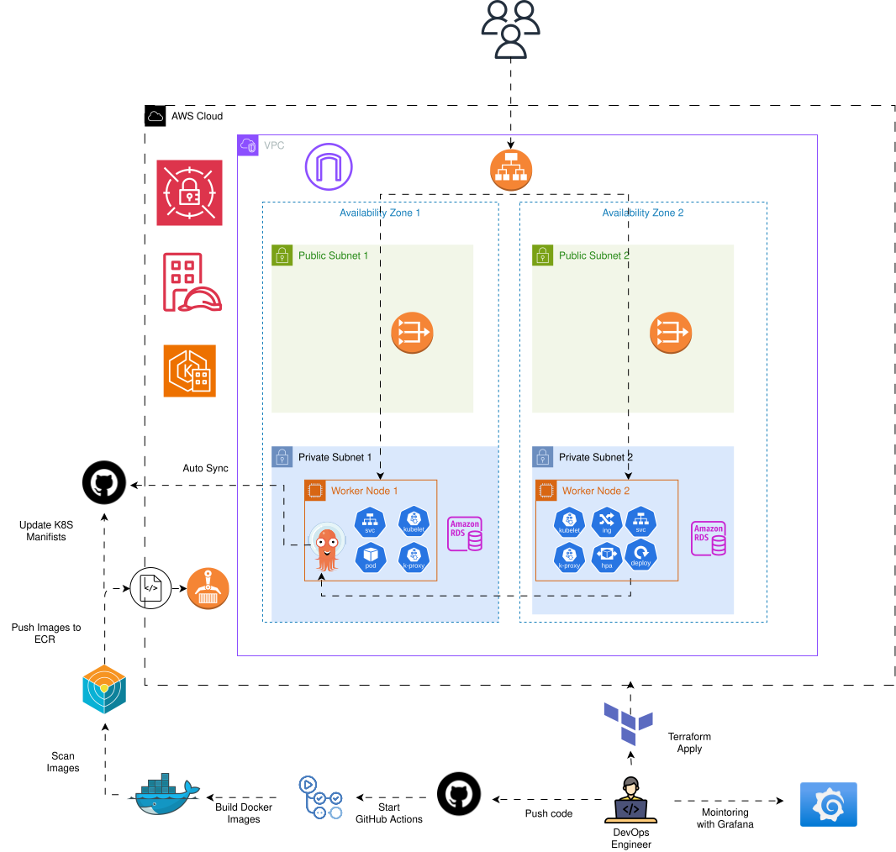
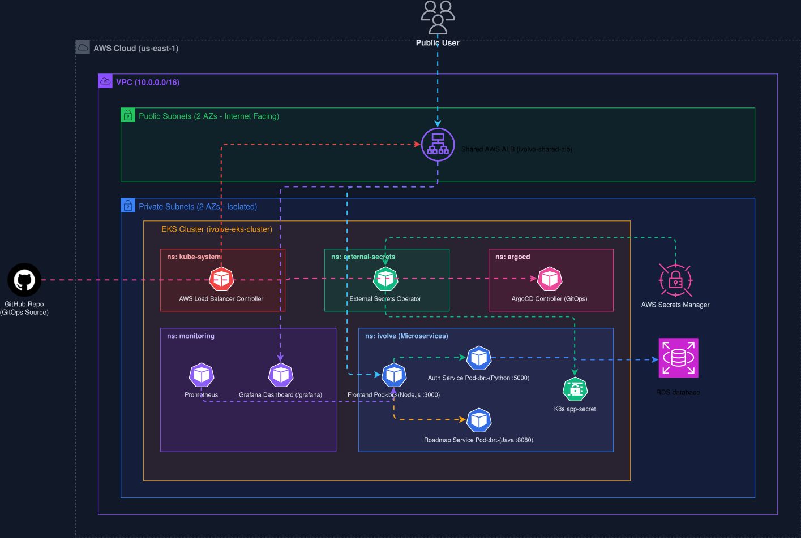
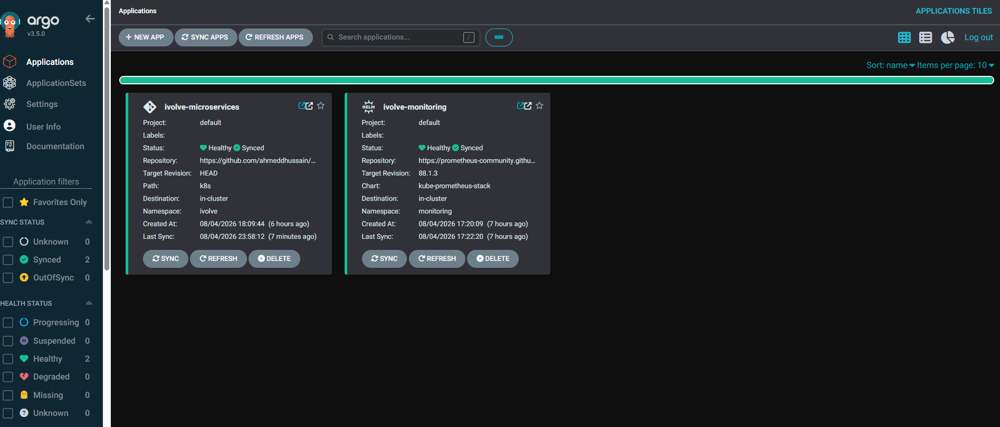
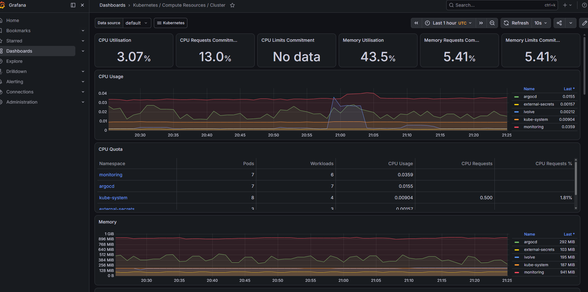
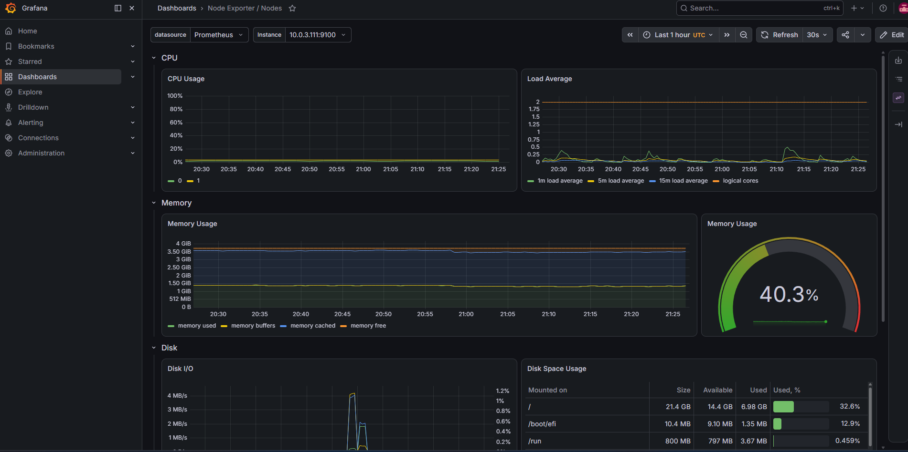
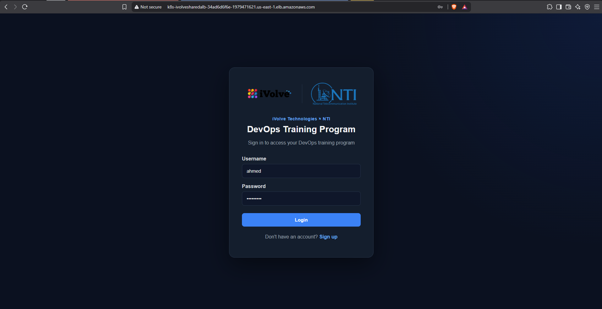
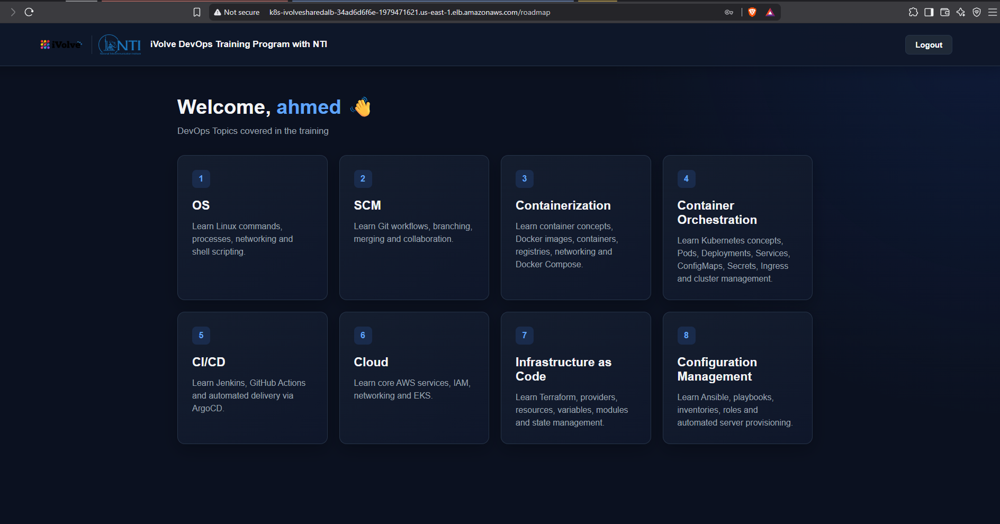
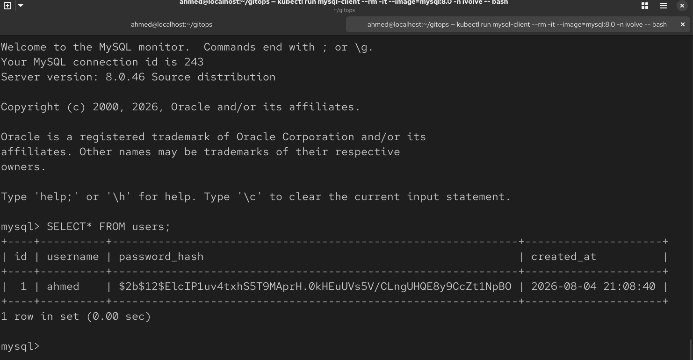

# ivolve-GitOps

An advanced, enterprise-grade DevOps platform for a microservices-based web application. This project demonstrates a 100% serverless CI and pull-based CD architecture using Docker, Terraform, Kubernetes (EKS), GitHub Actions (with AWS OIDC), ArgoCD, Amazon RDS, and AWS Secrets Manager via External Secrets Operator.


---

## Table of Contents

1. [Overview](#overview)
2. [Quick Start](#quick-start)
3. [Architecture](#architecture)
4. [Prerequisites](#prerequisites)
5. [Local Development with Docker Compose](#local-development-with-docker-compose)
6. [Infrastructure Provisioning with Terraform](#infrastructure-provisioning-with-terraform)
7. [Secrets Management: AWS Secrets Manager + External Secrets Operator](#secrets-management-aws-secrets-manager--external-secrets-operator)
8. [Container Orchestration with Kubernetes](#container-orchestration-with-kubernetes)
9. [Continuous Integration with GitHub Actions](#continuous-integration-with-github-actions)
10. [Continuous Deployment with ArgoCD](#continuous-deployment-with-argocd)
11. [Monitoring with Prometheus & Grafana](#monitoring-with-prometheus--grafana)
12. [System Verification & End-to-End Testing](#system-verification--end-to-end-testing)
13. [Real-World Troubleshooting & Solutions](#real-world-troubleshooting--solutions)
14. [Screenshots Index](#screenshots-index)

---

## Overview

This project is organized as a complete, zero-maintenance GitOps pipeline around a 3-tier microservice application : [`iVolveFinalProject`](https://github.com/Ibrahim-Adel15/iVolveFinalProject)

| Service | Technology | Responsibility | Port |
|---|---|---|---|
| `frontend` | Node.js / Express / EJS | Web UI | 3000 |
| `auth-service` | Python / Flask | Signup/login, DB access | 5000 |
| `roadmap-service` | Java / Spring Boot | Roadmap data (no DB) | 8080 |
| Amazon RDS (MySQL 8.0) | Managed | Stores users | 3306 |


## Quick Start

```bash
git clone https://github.com/ahmeddhussain/ivolve-GitOps.git
cd ivolve-GitOps
```

**1. (Optional) Test locally** — [details](#local-development-with-docker-compose)
```bash
cd docker && docker compose up --build
```

**2. Provision AWS infrastructure** — [details](#infrastructure-provisioning-with-terraform)
```bash
cd terraform
terraform init
terraform apply --auto-approve
```

**3. Point kubectl at the cluster**
```bash
aws eks update-kubeconfig --region us-east-1 --name ivolve-eks-cluster
kubectl get pods -n external-secrets   # confirm ESO is running (installed by Terraform)
```

**4. Deploy the app + secrets sync via ArgoCD** — [details](#continuous-deployment-with-argocd)
```bash
kubectl create namespace argocd
kubectl apply -n argocd -f https://raw.githubusercontent.com/argoproj/argo-cd/stable/manifests/install.yaml
kubectl apply -f argocd/application.yml
kubectl apply -f argocd/svc-lb.yml
```

**5. Set up GitHub Actions** — [details](#continuous-integration-with-github-actions)
- Confirm `GitHubActionsECRRole` exists (created by Terraform) and its trust policy matches your repo.
- Push to `main` under `docker/iVolveFinalProject/<service>/**` to trigger a pipeline — or run any workflow manually via **Actions → (workflow) → Run workflow**.
- Add your `AWS_ACCOUNT_ID` as a secret in Github Secrets.

**6. Verify**
```bash
kubectl get pods -n ivolve
kubectl get ingress -n ivolve
```
Open `http://<ALB_DNS_NAME>/signup`.

**7. (Optional) Deploy monitoring** — [details](#monitoring-with-prometheus--grafana)
```bash
kubectl apply -f argocd/mointoring-app.yml
```

---

## Architecture

### Infrastructure Overview




### Application Flow




---

## Prerequisites

* Docker and Docker Compose (local dev only)
* Terraform (>= 1.10)
* Helm (used by Terraform's `helm_release` resources — no separate manual install needed for the cluster add-ons themselves)
* AWS CLI configured with credentials that can manage VPC, EC2 networking, EKS, ECR, RDS, IAM, Secrets Manager, and S3
* kubectl
* A GitHub repository — **no server-side credentials to configure**, since CI auth is via OIDC (see the GitHub Actions section)

---

## Local Development with Docker Compose

RDS is CLoud Native only, so local dev still runs a throwaway MySQL container.

```bash
cd docker
docker compose up --build
```

* Frontend → `http://localhost:3000`
* Auth Service → `http://localhost:5000`
* Roadmap Service → `http://localhost:8080`

### Verify

* Sign up through the frontend.

  

* Log in and confirm the roadmap page loads.

  

* Confirm the record actually persisted:
  ```bash
  docker exec -it mysql mysql -u ahmed -p ivolve
  ```
  ```sql
  SELECT id, username, created_at FROM users;
  ```

  

```bash
docker compose down -v
```

---

## Infrastructure Provisioning with Terraform

### Modules

**`network`** —> VPC, 2 public + 2 private subnets across 2 AZs, IGW, single NAT Gateway, route tables, and Network ACLs.

**`eks`** —> cluster + 2-node managed node group in the private subnets, IAM roles, OIDC provider, and every IRSA role this project needs:
- AWS Load Balancer Controller (installed via `helm_release`, so the shared ALB gets provisioned automatically)
- External Secrets Operator's IRSA role (the Helm release itself is installed from root `main.tf`, not this module)
- **GitHub Actions OIDC**: a separate `aws_iam_openid_connect_provider` for `token.actions.githubusercontent.com`, plus `GitHubActionsECRRole`, trusted via a `StringLike` condition built from `var.github_repo` — see [Troubleshooting](#real-world-troubleshooting--solutions) for why this needs to be a wildcard, not an exact match.

**`ecr`** —> `ivolve-frontend`, `ivolve-auth`, `ivolve-roadmap` repositories.

**`rds`** —> single-AZ `db.t3.micro` MySQL instance, `publicly_accessible = false`, security group that only allows inbound 3306 from the EKS node security group (not `0.0.0.0/0`).

**`secrets`** —> one AWS Secrets Manager secret (`ivolve/app-secrets`) holding `DB_PASSWORD`, `DB_ROOT_PASSWORD`, `JWT_SECRET`, `DB_HOST` for pointing at the RDS. 
`db_password` is a single root-level variable passed identically into both the `rds` and `secrets` modules, so the database and the secret it's stored under can never drift apart.

**Root `main.tf`** also installs the **External Secrets Operator** directly via `helm_release` (same single-pass pattern as the ALB controller) — CRDs and controller both come up in one `terraform apply`, no separate `helm install` step.

### Commands

```bash
cd terraform
terraform init
terraform plan
terraform apply --auto-approve
```

> The `helm` provider in `provider.tf` is explicitly configured via `data.aws_eks_cluster_auth` against the cluster's own endpoint/CA, so both Helm releases — ALB controller and External Secrets Operator — install correctly in a single apply with no manual `aws eks update-kubeconfig` step required mid-run.

### Verification


---

## Secrets Management: AWS Secrets Manager + External Secrets Operator


### How it's wired

1. Terraform's `secrets` module creates `ivolve/app-secrets` in Secrets Manager with `DB_PASSWORD`, `DB_ROOT_PASSWORD`, `JWT_SECRET` , `DB_HOST`.
2. Terraform's `eks` module creates an IRSA role (`ivolve-eks-cluster-external-secrets-role`) trusted only for the `external-secrets-sa` ServiceAccount in the `ivolve` namespace, with a policy allowing `secretsmanager:GetSecretValue` / `DescribeSecret`.
3. `k8s/external-secrets.yml` (synced by ArgoCD like everything else in `k8s/`) defines:
   - the `external-secrets-sa` ServiceAccount, annotated with that IRSA role ARN
   - a `SecretStore` pointing at Secrets Manager, authenticating via that ServiceAccount's token (`auth.jwt.serviceAccountRef`)
   - an `ExternalSecret` that maps all three keys into a native Kubernetes `Secret` named `app-secret`, refreshed every hour (`refreshInterval: 1h`)
4. `auth-service` and `roadmap-service` consume `app-secret` the exact same way they'd consume any other k8s Secret — `envFrom.secretRef` .

### Verify

```bash
kubectl get secretstore,externalsecret -n ivolve
kubectl get secret app-secret -n ivolve -o jsonpath='{.data}' | jq
```
`SYNCED` status `True` on the `ExternalSecret`, and `app-secret` should contain the same four keys as the Secrets Manager entry (base64-encoded).


---

## Container Orchestration with Kubernetes

`k8s/` manifests, synced by ArgoCD into the `ivolve` namespace:

* `namespace.yml` — the `ivolve` namespace.
* `configmap.yml` — `DB_PORT`, `DB_NAME`, `DB_USER`, and the two inter-service URLs.
* `external-secrets.yml` — see above; produces `app-secret`.
* `frontend-deploy-svc.yml`, `auth-deploy-svc.yml`, `roadmap-deploy-svc.yml` — one Deployment + ClusterIP Service per microservice. `auth-service` and `roadmap-service` pull both `app-config` and `app-secret` via `envFrom`; `frontend-service` only needs the ConfigMap.
* `ingress.yml` — `frontend-ingress`, ALB, `IngressGroup: ivolve-shared-alb`, `group.order: "10"` (shares the ALB with Grafana's ingress from the monitoring stack, which uses `group.order: "1"` to take priority on its more specific `/grafana` path).


### Test Results

```bash
 kubectl get pods -n ivolve
 kubectl get svc -n ivolve
 kubectl get ingress -n ivolve
 ```


---

## Continuous Integration with GitHub Actions

Serverless, event-driven CI is handled by three individual GitHub Actions workflows, one per microservice, providing zero-maintenance, instant scaling, and enhanced security.


### Trigger

Workflows are strictly path-filtered. The CI process only consumes build minutes if the specific microservice's source code or its workflow file actually changes.

```yaml
on:
  workflow_dispatch:
  push:
    branches: [ main ]
    paths:
      - 'docker/iVolveFinalProject/<service>/**'
      - '.github/workflows/ci-<service>.yml'
```

### Pipeline stages (`ci-frontend.yml`, `ci-auth.yml`, `ci-roadmap.yml`)

```text
Checkout
  ↓
Configure AWS Credentials via OIDC (aws-actions/configure-aws-credentials)
  ↓
Log in to ECR
  ↓
Build Docker Image (docker/iVolveFinalProject/<service>)
  ↓
Trivy Scan (severity HIGH,CRITICAL — exit-code 0: reports, doesn't fail the build)
  ↓
Push to ECR (tagged with ${{ github.run_number }})
  ↓
Update k8s/<service>-deploy-svc.yml image tag (sed)
  ↓
Commit + push to main (GitOps trigger for ArgoCD)
```

### Authentication — no stored AWS keys at all

This architecture completely eliminates static, long-lived AWS IAM Access Keys. GitHub Actions dynamically requests temporary STS credentials directly from AWS via OpenID Connect (OIDC).


```yaml
permissions:
  id-token: write
  contents: write

- uses: aws-actions/configure-aws-credentials@v4
  with:
    role-to-assume: arn:aws:iam::<account_id>:role/GitHubActionsECRRole
    aws-region: us-east-1
```

- The AWS trust policy validates the `token.actions.githubusercontent.com:repository` claim to ensure only this specific repository can assume the role.
- Because a monorepo structure allows multiple CI pipelines to finish and push at the exact same millisecond, concurrent git push attempts to the main branch can fail with non-fast-forward rejections.This is solved using a retry-and-rebase loop in the final GitOps push step, ensuring all concurrent manifest updates queue and merge cleanly without failing the build.
- `AWS_ACCOUNT_ID` is stored as a secret in the repoistry secrets and is used by the 3 Workflows on runing the CI.


### Test Results


---

## Continuous Deployment with ArgoCD

 Deployed in the EKS cluster for GitOps `automated` sync with `prune: true` / `selfHeal: true` — just pointed at this repo.

### `argocd/application.yml`
* **Repository:** `https://github.com/ahmeddhussain/ivolve-GitOps.git`
* **Path:** `k8s/`
* **Destination namespace:** `ivolve`

### Setup

```bash
aws eks update-kubeconfig --region us-east-1 --name ivolve-eks-cluster
kubectl create namespace argocd
kubectl apply -n argocd -f https://raw.githubusercontent.com/argoproj/argo-cd/stable/manifests/install.yaml
kubectl apply -f argocd/application.yml
kubectl apply -f argocd/svc-lb.yml

kubectl -n argocd get secret argocd-initial-admin-secret -o jsonpath="{.data.password}" | base64 -d; echo
kubectl get svc argocd-server -n argocd
```

### Test Results



---

## Monitoring with Prometheus & Grafana

Cluster and infrastructure metrics via the `kube-prometheus-stack` Helm chart (Prometheus + Grafana + Alertmanager + node-exporter + kube-state-metrics), deployed the same GitOps way as the app itself — as an ArgoCD Application whose `source` is a Helm chart rather than a git path.
 
### Scope: infrastructure-only
 
This covers **cluster and pod-level metrics only** — node CPU/memory, pod restarts, resource usage, EKS control-plane health, and Kubernetes object state (Deployments, StatefulSets, PVCs). All of that comes from `node-exporter` and `kube-state-metrics`, both bundled in the chart and both bundled with their own `ServiceMonitor`s (`monitoring.coreos.com/v1`, installed as part of the same Helm release).
 
What this setup does **not** give you: application-level metrics like requests/sec, response latency, or error rate per microservice. Those only exist if the app itself exposes them (e.g. via `prom-client`, `prometheus-flask-exporter`, or Spring Actuator) — genuinely out of scope here since it requires touching the app source.
 
### Why it shares the ALB
 
Grafana shares the **same ALB** as the frontend instead of provisioning a second load balancer, via the AWS Load Balancer Controller's `IngressGroup` feature — both `k8s/ingress.yml` (frontend, `/`) and the chart's own Grafana ingress (`/grafana`) carry the annotation `alb.ingress.kubernetes.io/group.name: ivolve-shared-alb`, so the controller merges them into one ALB with two path rules. `group.order` (`10` for the frontend, `1` for Grafana) makes sure the more specific `/grafana` rule is evaluated before the frontend's catch-all `/`.

### Deploy:

```bash
kubectl apply -f argocd/mointoring-app.yml
```

### Access Grafana
 
```text
http://<ALB_DNS_NAME>/grafana
```
 
Default login is `admin` / the chart's auto-generated admin password:
```bash
kubectl get secret -n monitoring monitoring-grafana -o jsonpath="{.data.admin-password}" | base64 -d; echo
```
 

Grafana ships with pre-built dashboards for Kubernetes cluster health, node resource usage, and per-namespace/per-pod resource consumption out of the box — no extra setup needed for those.

### Test Results

Go to `http://<ALB_DNS_NAME>/grafana`, log in, then Dashboards in the left sidebar. The chart ships a set of pre-built dashboards — these are the ones worth opening:

- **Kubernetes / Compute Resources / Cluster:** Total CPU/memory usage across your whole 2-node cluster, as live graph
- **Node Exporter / Nodes	Raw host-level:** metrics per  node — CPU, memory, disk, network, load average




---

## System Verification & End-to-End Testing

```text
http://<ALB_DNS_NAME>/signup
```

1. Sign up and log in — `auth-service` writes to **RDS**, not an in-cluster pod.
2. Roadmap page loads — `roadmap-service` responds independently of the DB.
3. Confirm persistence directly against RDS:
   ```bash
   kubectl run mysql-client --rm -it --image=mysql:8.0 -n ivolve -- \
     mysql -h <rds_endpoint> -u ahmed -p ivolve -e "SELECT id, username, created_at FROM users;"
   ```





---

## Real-World Troubleshooting & Solutions

This section documents the actual technical bugs encountered during the platform build, how they were diagnosed, and the permanent architectural fixes applied.


### 1. GitHub Actions OIDC — `Not authorized to perform sts:AssumeRoleWithWebIdentity`

* **Symptom:** The `aws-actions/configure-aws-credentials` step failed with `Not authorized to perform sts:AssumeRoleWithWebIdentity`, even though the IAM role and OIDC provider existed in AWS.
* **Diagnosis:** Decoding the runtime OIDC JWT payload (`echo "$TOKEN" | cut -d. -f2 | base64 -d | jq`) revealed that GitHub embeds **immutable numeric IDs** directly inside the `sub` claim string:
  ```json
  "sub": "repo:ahmeddhussain@209910264/ivolve-GitOps@1322943035:ref:refs/heads/main"
  ```
A standard IAM wildcard condition like repo:ahmeddhussain/* expects a / immediately after the username; the runtime claim had @209910264/ instead, causing AWS IAM to silently reject the token match.
* **Fix:** Built the `StringLike` pattern dynamically from `var.github_repo` using `replace(var.github_repo, "/", "*"), producing "repo:${replace(var.github_repo, "/", "*")}*" ` — the * wildcards absorb the numeric IDs wherever GitHub inserts them without needing to hardcode the IDs.

### 2. ArgoCD Sync Blocked by Missing CRDs `(external-secrets.io/v1beta1)`

* **Symptom:** ArgoCD sync failed with `failed to discover server resources for group version external-secrets.io/v1beta1: the server could not find the requested resource`
* **Diagnosis:** The external-secrets Helm chart defaults to `installCRDs = false` unless explicitly enabled. Consequently, Helm deployed the operator controller without registering the Custom Resource Definitions in EKS, causing ArgoCD to reject ExternalSecret manifests.
* **Fix:** Added `set { name = "installCRDs" value = "true" }` to the Terraform `helm_release.external_secrets ` resource block and updated manifest apiVersions to `external-secrets.io/v1` to match the cluster's stable primary CRD version

### 3. `kube-prometheus-stack` sync stuck — `metadata.annotations: Too long: may not be more than 262144 bytes`

* **Symptom:** ArgoCD sync for the monitoring stack hung, throwing annotation size limit errors.
* **Diagnosis:** ArgoCD's default client-side kubectl apply stores the entire manifest in the last-applied-configuration annotation. The Prometheus chart's OpenAPI schemas exceed Kubernetes' 256KiB annotation limit, preventing the CRDs from applying.
* **Fix:**  Added `ServerSideApply=true` to the monitoring Application's syncOptions in argocd/monitoring-application.yml, which executes the apply server-side without generating client annotations.

---


## Screenshots Index

Quick reference for every file in [`screenshots/`](./screenshots/) and where it's used above.

| File | Shows | Used in|
|---|---|---|
| `graph.drawio.svg` | Application flow | Architecture |
| `Diagram-2.drawio.svg` | Infrastructure Architecture | Architecture |
| `image` | Local signup page | Docker Compose |
| `image-1` | Local roadmap page after login | Docker Compose |
| `image-2` | Local MySQL container, `SELECT * FROM users` | Docker Compose |
| `aws-infra-1` | AWS Console resources | Terraform |
| `aws-infra-2` | AWS Console resources | Terraform |
| `k8s` | `kubectl get pods/svc/ingress -n ivolve` | Kubernetes |
| `github` | GitHub Actions Workflow Success | GitHub Actions |
| `github-2` | Verify `OIDC` is working | GitHub Actions |
| `argocd` | Argocd applications `synced` and `healthy`| ArgoCD |
| `image-17` | Grafana login via the shared ALB | Mointoring |
| `grafana-1` | Grafana Kubernetes / Compute Resources / Cluster Dashboard | Mointoring |
| `grafana-2` | Grafana Node Exporter / Nodes Dashboard | Mointoring |
| `test-1` | `k8s-alb` opening the application via ingress | System Verification |
| `test-2` | `auth-svc` worked and connected to `roadmap-svc` after login | System Verification |
| `test-3` | Credentials stored in `RDS` | System Verification |


---
